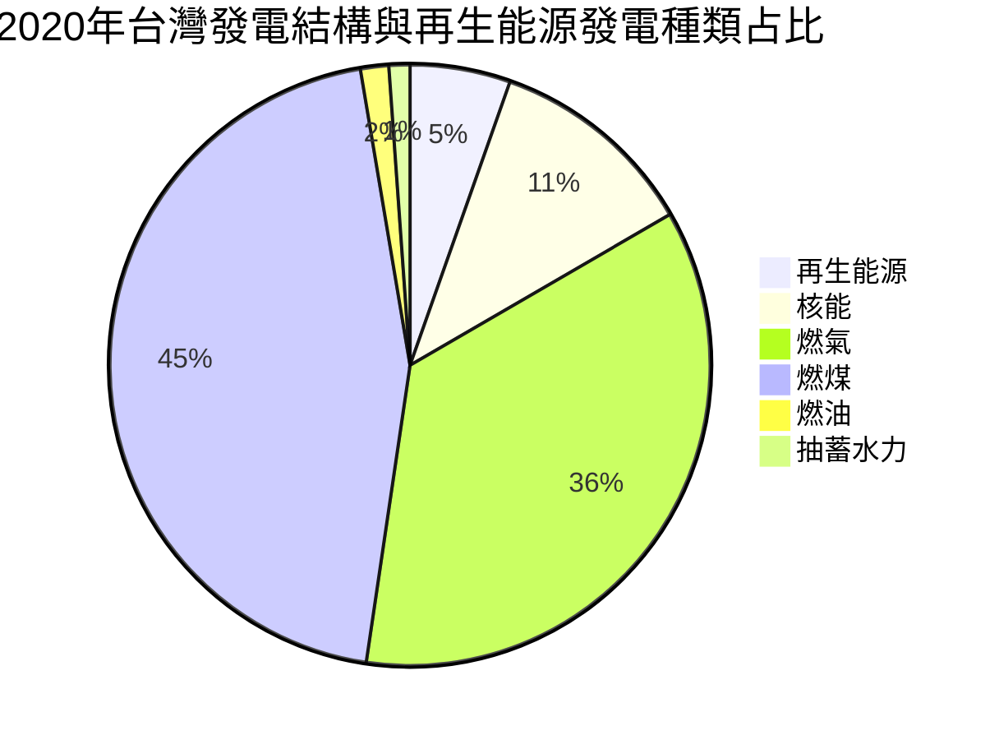

# 為什麼要學 [HackMD](https://medium.com/starrocket/hackmd-product-story-1e332f83d343)

* 線上筆記，可跨平台
* 支援多人協作服務，也可作為簡單的筆記軟體，用以寫工作日誌、筆記、共筆 ... 等
* 可使用標籤（tag）進行分類與管理
* Marker好幫手，支援程式碼跟語法，例如 C、shell、YAML、MathJax、Uml ... etc.
* 提供「簡報模式」跟「書籍模式」
* 請支持[國產優質筆記](https://github.com/hackmdio) ( github 可找到其 source code )


----

# 什麼是 [Markdown](https://zh.wikipedia.org/wiki/Markdown)

* Markdown 是一種輕量級標記式語言， 它有純文字標記的特性，讓編寫的可讀性提高，這是在以前很多電子郵件中就已經有的寫法，而目前也有很多網站都使用 Markdown 來撰寫說明文件或是在論壇上發表文章與發送訊息


* 相較 HTML 之下，不會夾雜很多不必要的標籤，讓可讀性提高。不需要像程式碼一樣縮排。

----
   

----

# 標題

# Heading

## Heading

## Heading

### Heading

#### Heading


----

# 基本文字編輯

上標^上標^
下標~下標~

* 基本文字編輯
* **粗體**
* *斜體*
* ~~刪除線~~
* ==Highlight==
* 上標^上標^
* 下標~下標~
* {平仮名|ひらがな}
* {down string|upper string}

----

# 程式碼

```clike
int i;
```

```clike=10
    showTime(1,sleepT,"usleep");
    for (int i = 0; i < sleepLoop; ++i) {
        usleep(sleepMs * 1000); // wait
    }
```

----

# Emoji

:smiley:  :heart_eyes:  :point_right:


[完整清單](https://github.com/ikatyang/emoji-cheat-sheet)

ps: 實測結果，不是每個都可以正常顯示


----


# 警告區塊

裡面可以嵌入 Emoji

:::success
:tada: 喔耶~~~
:::

:::info
:mega: 這是訊息
:::

:::warning
:zap: 注意
:::

:::danger
:fire: 喔不
:::


----

# 插入圖片


==250x300== 表示圖片 ==寛x長==


或用 =10%x 表示==比例大小==

----

# 插入影片 或 投影片


## youtube





### Workground for Github

1. 範例: https://www.youtube.com/watch?v=8pXFktAbx5Y
2. 取得封面 URL: https://img.youtube.com/vi/8pXFktAbx5Y/sddefault.jpg ([參考](https://www.kocpc.com.tw/archives/273287))
3. 製作一個 "圖片超連結"

```
[](youtube URL)
```

[](https://www.youtube.com/watch?v=8pXFktAbx5Y)


## 圖片中嵌入文字

* 非標準，與 HackMD 無關
* 使用第三方服務 API: sirv.com 
    * [使用說明](https://sirv.com/help/articles/dynamic-imaging/text/)

語法:

```
https://demo.sirv.com/oman.jpg?text=openlab_%22%E4%BC%B4%E4%BC%B4%E5%AD%B8%22
```

效果:

* 中文無法顯示


* 字型大小會等距拉寬至圖片寬度


## slideshare




## pdf

請使用 https 的網址，否則可能會被您的瀏覽器阻擋載入



----

# 插入表格


|<span style="font-weight:normal">heading</span>|
|:---------------------------------------------:|

| Deveui   | 000008fffe063800     | 
| -------- | --------             | 
| appskey  | 1024f9a17f544cabaa21dc2500000000   | 
| nwkskey  | aed9c85f49b9402dbaae7af200000000   | 
| appeui  | 0000000000000000   | 


| Deveui   | 000008fffe063800     | 
| :-------- | :--------             | 
| appskey  | 1024f9a17f544cabaa21dc2500000000   | 
| nwkskey  | aed9c85f49b9402dbaae7af200000000   | 
| appeui  | 0000000000000000   | 

向右對齊
| Deveui   | 000008fffe063800     | 
| --------: | --------:             | 
| appskey  | 1024f9a17f544cabaa21dc2500000000   | 
| nwkskey  | aed9c85f49b9402dbaae7af200000000   | 
| appeui  | 0000000000000000   | 

置中
| Deveui   | 000008fffe063800     | 
| :--------: | :--------:             | 
| appskey  | 1024f9a17f544cabaa21dc2500000000   | 
| nwkskey  | aed9c85f49b9402dbaae7af200000000   | 
| appeui  | 0000000000000000   | 


----

## 註腳

註腳 1 連結[^first].

註腳 2 連結[^second].

行內註腳^[行內註腳的文字] 定義

重複的註腳參考[^second].

[^first]: 註腳 **也可以標記**
    還可以有很多段落
[^second]: 註腳 文字

## 定義清單

名詞 1

:   定義 1 快速連續項目

名詞 2 加上 *行內標記*

:   定義 2

        { 這些程式碼屬於 定義 2 的一部分 }

    定義 2 的第三段落

_緊密樣式：_

名詞 1
  ~ 定義 1

名詞 2
  ~ 定義 2a
  ~ 定義 2b

## 縮寫

這是 HTML 的縮寫範例
它會轉換 "HTML"，但是縮寫旁邊其他的部分，例如："xxxHTMLyyy"，不受影響

*[HTML]: Hyper Text Markup Language

----

# 共享筆記

## 如何分享


## 看誰在編輯?!


## comment
> [name=Bruce Ke]

----

# 引用 留言

> hello[name=Bruce Ke]

> 筆誤! 正確書寫方式訂正
> [name="Bruce"][time=Sun, Jun 28, 2020 10:00 PM][color=yellow]

---


> 引用[color=#907bf7]
>> 巢狀引用區塊 [color=red]


---

# 繪圖



更多繪圖

---


:bulb: 其實，小數點不用自己精算，但加起來還是要100喔。

:point_right: 更多數學式跟圖表的世界，可以到[這裡](https://hackmd.io/s/MathJax-and-UML-tw)探索。

---

# $\LaTeX$ 語法與示範

## [Latex 介紹](https://zh.wikipedia.org/zh-tw/LaTeX)

在 HackMD 中，必須以$包圍住才會認得是 $\LaTeX$ 語法 (需緊鄰著數學式，中間不能有任何空白鍵)

e.g.

$x\times 3^0 + x\times 3^1 + x\times 3^2$

$$
{ a+b \brace c+d }
$$


$$
\overline{AB}
$$


Ref:

1). [$\LaTeX$ 語法筆記](https://hackmd.io/@RintarouTW/%E6%84%9A%E5%8D%83%E6%85%AE%E3%81%AE%E7%AD%86%E8%A8%98%E6%9C%AC/%2F%40RintarouTW%2FLaTeX_%25E8%25AA%259E%25E6%25B3%2595%25E7%25AD%2586%25E8%25A8%2598)


https://hackmd.io/@sysprog/gnu-linux-dev/https%3A%2F%2Fhackmd.io%2Fs%2FB1RwlM85Z

2).
https://hackmd.io/s/MathJax-and-UML-tw


----


<style>
    body{
    background-color:transparent!important;
    /* background-color:blue!important*/
 background-image: url("http://3.bp.blogspot.com/-hazaIdzHs8I/T7mvxvrAxNI/AAAAAAAABig/WFaYtokGa8Q/s400/%E6%93%B7%E5%8F%96%E9%81%B8%E5%8F%96%E5%8D%80%E5%9F%9F_006.png")!important;
 z-index:10000!important;
  background-repeat: repeat-y!important;
    }
    
    .progress{
height:14px !important;
}

.progress span{
height:14px !important;
background: url("dat")!important;
.progress span:after, .progress span.nyancat{
	content: "open";
	background: url('http://3.bp.blogspot.com/-hazaIdzHs8I/T7mvxvrAxNI/AAAAAAAABig/WFaYtokGa8Q/s400/%E6%93%B7%E5%8F%96%E9%81%B8%E5%8F%96%E5%8D%80%E5%9F%9F_006.png')!important;
</style>